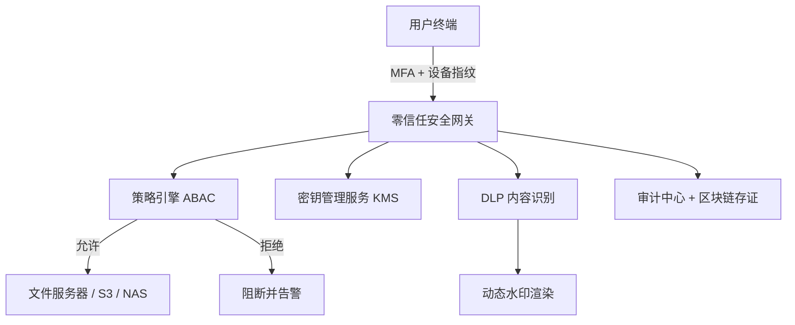

# FileGuard - 企业文件访问控制系统

[](LICENSE)
[](https://goreportcard.com/report/github.com/L1566/FileGuard)
[](https://hub.docker.com/r/L1566/FileGuard)

**FileGuard** 是一个面向企业的文件访问控制与防泄露系统，基于零信任思想，提供细粒度的权限管理、动态加密、行为审计和终端防护能力。  
- **通用性**：适用于制造、金融、研发等任何对敏感文件有保护需求的行业  
- **示例场景**：以新能源汽车企业为核心演示背景，展示如何防止设计图纸、电池配方、供应链数据等被盗或外泄

---

## 背景与痛点

传统文件访问控制（如 ACL、NTFS 权限）存在以下问题：
- **静态授权**：权限一旦授予，长期有效，无法应对实时风险
- **内部威胁**：离职员工、恶意管理员可批量窃取文件
- **边界失效**：移动办公、云协作使传统内网隔离形同虚设

在新能源汽车企业中，典型风险包括：
- 研发人员私自拷贝整车设计图到个人 U 盘
- 离职工程师批量导出自动驾驶核心代码
- 供应商通过协作通道非法留存电池配方文档

FileGuard 通过动态授权、全链路加密、行为审计三大支柱，系统性解决上述问题。

---

## 核心特性

| 特性 | 说明 |
|------|------|
| **多因素认证 (MFA)** | 支持 TOTP、短信、生物特征，并与企业 LDAP/AD 同步 |
| **基于属性的访问控制 (ABAC)** | 动态判定用户属性、文件属性、环境属性（时间/IP/设备） |
| **透明加密 + KMS** | 文件存储/传输/缓存全加密，密钥与用户/设备绑定，托管于硬件安全模块 (HSM) |
| **安全沙箱与数字水印** | 核心文件在沙箱中打开，防截屏、录屏；屏幕/文档实时渲染隐形水印 |
| **数据防泄漏 (DLP)** | 识别敏感内容（如“电池参数”“电机图纸”），阻断外发并告警 |
| **全行为审计 + UEBA** | 记录所有文件操作，通过用户行为分析发现异常批量下载、深夜访问等 |
| **零信任架构** | 所有访问请求必经安全网关，不信任任何内网/外网环境 |

---

## 系统架构概览



**核心组件说明**：
- **零信任网关**：所有请求必经，验证身份、设备、上下文后转发
- **策略引擎**：基于 ABAC 模型计算允许/拒绝，支持热加载规则
- **KMS**：管理文件加密密钥，密钥分段存储于 HSM，管理员无法单独获取
- **审计中心**：日志哈希上链，防篡改；提供可视化溯源界面
- **终端客户端**：实现沙箱、水印、DLP 拦截（支持 Windows/macOS/Linux）

---

## 快速开始

### 环境要求
- Docker & Docker Compose
- Go 1.20+ （根据实现语言）
- 4GB RAM，2 CPU

### 一键部署
```bash
git clone https://github.com/L1566/FileGuard.git
cd fileguard/deploy
docker-compose up -d
```

### 配置示例
1. 访问 Web 管理端 `https://localhost:8443`，默认账号 `admin / fileguard2025`
2. 导入测试用户（来自 `example/users.csv`）
3. 定义策略（见下方示例）

### 测试文件访问
```bash
# 使用研发工程师账号登录客户端
./fileguard-cli login --user engineer@evcompany.com
# 尝试访问敏感文件
./fileguard-cli open /secure/battery_parameters.xlsx
# 预期：非工作时间或未使用沙箱时被拒绝
```

---

## 以新能源汽车企业为例的典型策略

下表展示了基于 ABAC 的常用规则（策略引擎 JSON 格式）：

| 角色 | 可访问文件 | 限制条件 | 动作 |
|------|------------|----------|------|
| 电池工程师 | `BOM/电池/*.xlsx` | 工作时间 09:00-18:00，公司 IP 段，设备合规 | 允许只读，禁止打印/外发 |
| 自动驾驶算法员 | `感知模块/*.py` | 必须通过安全沙箱打开 | 允许编辑，但禁止截屏 |
| 供应商协作账号 | `接口规范.pdf` | 有效期30天，仅在线预览 | 动态水印（含账号+时间），禁止下载 |
| 质量审核员 | `路测数据/*.log` | 仅限指定设备 MAC 地址 | 允许下载，但文件自动加密且7天过期 |

**策略片段示例（JSON）**：
```json
{
  "effect": "allow",
  "condition": {
    "user.role": "battery_engineer",
    "file.path": "regex:^/secure/BOM/电池/",
    "environment.time": "between 09:00-18:00",
    "environment.ip_cidr": "10.0.0.0/8",
    "device.compliant": true
  },
  "restrictions": ["no_print", "no_export"]
}
```

---

## 扩展与定制

FileGuard 设计为高度可插拔，支持以下定制点：

- **策略引擎插件**：实现自定义属性（如项目代号 `project:Apollo`、设备安全评分）
- **存储适配器**：目前支持本地文件系统、MinIO、AWS S3、阿里云 OSS
- **身份源集成**：LDAP、OAuth2、企业微信、钉钉、飞书
- **DLP 规则引擎**：可配置关键词、正则、机器学习分类器
- **审计后端**：支持 Elasticsearch、Splunk、区块链（Hyperledger Fabric）

---

## 安全与合规

- **等保2.0三级**：满足身份鉴别、访问控制、安全审计等要求
- **日志防篡改**：每5分钟将日志哈希锚定到公有区块链（或本地 WORM 存储）
- **GDPR / 个人信息保护法**：支持文件内容脱敏（自动遮盖身份证、手机号）
- **密钥生命周期管理**：定期轮换，支持吊销

---

## 贡献指南

欢迎贡献代码、文档或提出建议！

1. Fork 本仓库
2. 创建特性分支 (`git checkout -b feature/amazing-feature`)
3. 提交修改 (`git commit -m 'Add some amazing feature'`)
4. 推送分支 (`git push origin feature/amazing-feature`)
5. 开启 Pull Request

请确保：
- 代码通过 `golangci-lint` 或 `pylint`
- 新增功能包含单元测试
- 更新相关文档

---

## 开源协议

AGPL v3。详见 [LICENSE](LICENSE) 文件。

---

## 致谢与参考

- [NIST SP 800-207: Zero Trust Architecture](https://nvlpubs.nist.gov/nistpubs/SpecialPublications/NIST.SP.800-207.pdf)
- 感谢某新能源汽车企业提供的真实业务场景与痛点输入
- 部分加密实现参考 [MinIO KES](https://github.com/minio/kes)

---

## 联系我们

- 提交 Issue：[GitHub Issues](https://github.com/L1566/FileGuard/issues)
- 邮件：security@fileguard.io
- 企业支持：提供商业版技术支持与定制开发

**FileGuard - 让每个文件都在掌控之中**
```
